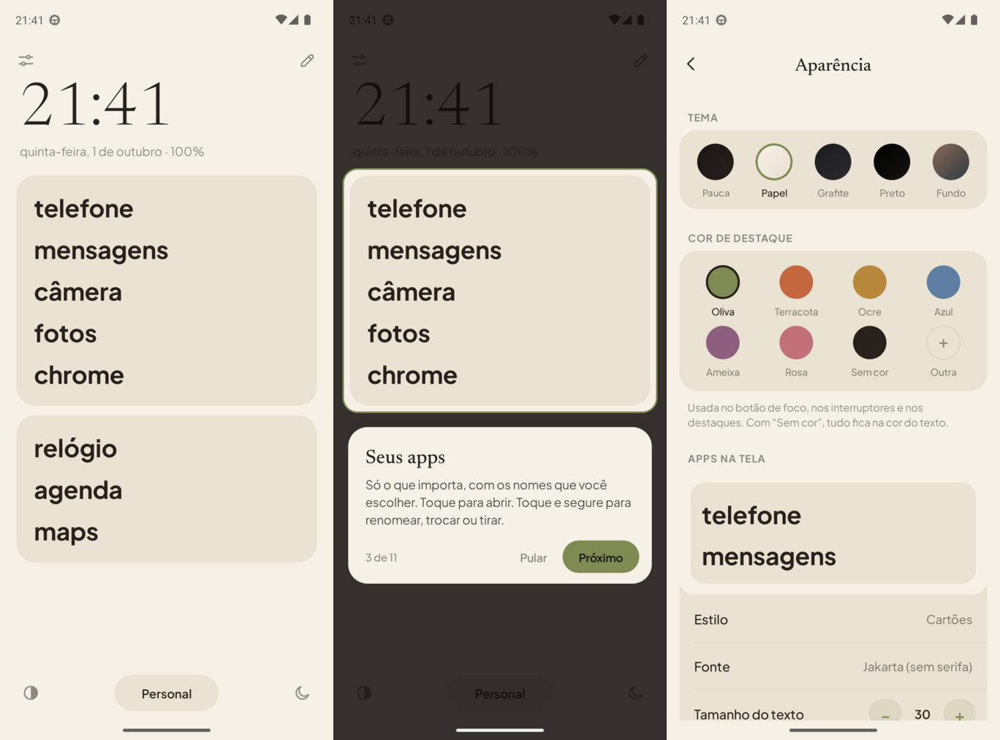

<p align="center"></p>

# Pauca

Launcher minimalista para Android, inspirado no Dumb Phone do iOS: só texto, em cartões, com os nomes que você escolher, e um modo foco que silencia o celular de verdade.

O nome vem do latim *pauca*, "poucas coisas", como no lema de Gauss: *pauca sed matura*, poucas, mas maduras.

<p align="center"></p>

Feito por [Gabriel Dias](https://github.com/berelels) a partir do [Olauncher](https://github.com/tanujnotes/Olauncher), de Tanuj.

<sub>Uma nota honesta: eu não programo em Kotlin. A ideia, o design, as decisões e os testes no meu próprio celular são meus; o código foi escrito pelo Claude, a IA da Anthropic, sob a minha direção. Por isso este README explica com calma como cada parte funciona: é o mapa para entender o projeto.</sub>

## Onde baixar

O Pauca vai estar na Play Store como app pago: é o jeito de apoiar o projeto. O código continua aberto aqui, sob a GPLv3, e quem preferir pode compilar e usar de graça (veja [Compilar](#compilar)).

## O que tem

- **Cartões de apps.** Organize os apps em grupos, como no Dumb Phone. Arraste para reordenar (inclusive de um grupo para outro) e renomeie cada um com o texto que quiser. Dá para usar letras minúsculas, como escrito ou MAIÚSCULAS.
- **Perfis.** Pessoal, Trabalho, Noite… Cada perfil tem os seus próprios cartões, e você troca pelo botão de baixo. Um perfil pode ligar o modo foco sozinho.
- **Relógio do seu jeito.** Formato da hora e da data (com padrões prontos ou personalizado), fonte, tamanho, peso, alinhamento e cor de destaque. Também dá para mostrar só o relógio, só a data ou nada. Bateria e tempo de tela podem aparecer ao lado da data.
- **Aparência.** Cinco temas: Pauca, Papel, Grafite, Preto e Fundo. O Fundo usa o papel de parede do celular ou uma imagem sua, com brilho ajustável e desfoque (o desfoque do papel de parede do sistema depende do celular; o de uma imagem sua funciona em qualquer um). A cor de destaque é à parte: oliva (padrão), terracota, ocre, azul, ameixa, rosa, sem cor ou qualquer cor em hexadecimal. Para os apps e para o relógio, escolha a fonte (Jakarta, Newsreader, a do sistema, serifada do sistema ou monoespaçada), o tamanho, o peso e o alinhamento (esquerda, centro ou direita).
- **Botões.** Os botões de cima (ajustes, editar) e os de baixo (tema, perfil, foco) têm três modos: sempre visíveis, ocultos ou "ao tocar", em que aparecem quando você toca no topo ou na base da tela e somem depois de 5 segundos. Cada botão também pode ser desligado sozinho, e a barra de status do celular pode ser ocultada.
- **Tour guiado.** Quando o Pauca vira o launcher padrão, um tour mostra cada parte da tela. Dá para ver de novo nos ajustes.
- **Idiomas.** Inglês (padrão), português e espanhol. Troque em Ajustes › Idioma.
- **Modo foco.** É feito em camadas, e cada uma funciona com a sua permissão:
  - **Não Perturbe:** liga uma regra própria do Pauca e não mexe no Não Perturbe que você ativa à mão. Você escolhe quem pode ligar: ninguém, favoritos, contatos ou todos. Ligações repetidas também podem tocar.
  - **Segurar notificações:** as notificações de apps fora da lista somem. Quando o foco acaba, aparece um resumo ("8 notificações de 3 apps").
  - **Gaveta:** mostra só os apps permitidos.
  - **Bloquear apps:** se um app fora da lista abrir, o celular volta para o início (usa a acessibilidade).
  - **Tons de cinza:** precisa de um comando adb, uma vez (veja abaixo).
- **Gaveta de apps.** Busca no topo, botões de categoria (social, produtividade, finanças, música e vídeo…) e uma lupa flutuante. A categoria vem do Android ou de uma lista de apps conhecidos, e dá para trocar no toque longo › Categoria.
- **Gestos.** Deslize para cima para ver todos os apps e para baixo para as notificações. Deslizar para os lados abre um app (escolha nos ajustes). Toque duplo bloqueia a tela, e tocar e segurar no fundo abre os ajustes.
- **Privacidade.** Sem permissão de internet e sem coleta de dados.

## Compilar

Requisitos: JDK 17+ e o Android SDK (platform 36).

```bash
./gradlew assembleDebug
```

O APK sai em `app/build/outputs/apk/debug/app-debug.apk`. Para instalar num celular com a depuração USB ligada:

```bash
adb install -r app/build/outputs/apk/debug/app-debug.apk
```

Depois, escolha o Pauca como app de início (Ajustes › Apps › Apps padrão › App de início).

### Modo foco em tons de cinza

O Android só deixa um app mudar as cores da tela com uma permissão especial. Para concedê-la, rode uma vez (no build de debug o pacote é `app.pauca.debug`):

```bash
adb shell pm grant app.pauca android.permission.WRITE_SECURE_SETTINGS
```

## Como o código está organizado

| Parte | Arquivo |
|---|---|
| Perfis, cartões e apps (JSON nas SharedPreferences) | `data/HomeModel.kt`, `data/HomeStore.kt` |
| Temas e cores de destaque | `data/Palette.kt` |
| Papel de parede (fundo, desfoque, brilho) | `ui/Wallpaper.kt`, `ui/WallpaperFragment.kt` |
| Tela inicial, gestos e barras | `ui/HomeFragment.kt`, `ui/GestureFrameLayout.kt` |
| Tour guiado | `ui/TourView.kt` |
| Editor de cartões e seletor de apps | `ui/EditHomeFragment.kt`, `ui/AppPickerFragment.kt` |
| Ajustes (todas as páginas) | `ui/SettingsPageFragment.kt`, `ui/SettingsBuilder.kt` |
| Modo foco | `focus/FocusManager.kt`, `focus/FocusListenerService.kt`, `helper/MyAccessibilityService.kt` |
| Gaveta de apps e categorias | `ui/AppDrawerFragment.kt`, `ui/AppDrawerAdapter.kt`, `data/AppCategory.kt` |

## Licença

GPLv3, a mesma do Olauncher (veja [LICENSE](LICENSE)). As fontes [Newsreader](https://github.com/productiontype/Newsreader) e [Plus Jakarta Sans](https://github.com/tokotype/PlusJakartaSans) seguem a SIL Open Font License (veja [licenses/](licenses/)).
