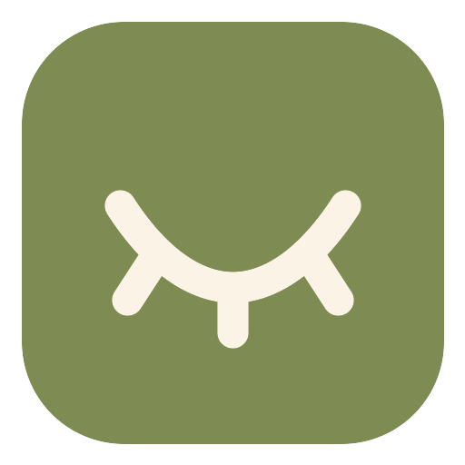
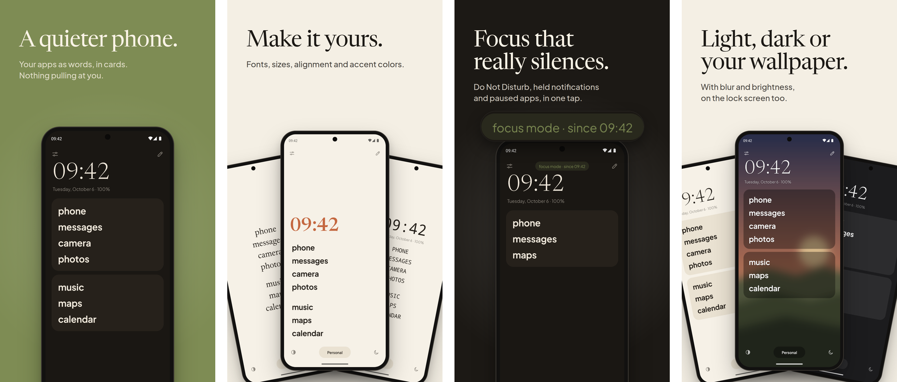

<p align="center"></p>

# Pauca

A minimalist Android launcher inspired by the iOS Dumb Phone: text only, in cards, with the names you choose, and a focus mode that actually quiets your phone.

The name comes from the Latin *pauca*, "few things", as in Gauss's motto: *pauca sed matura*, few, but ripe.

**Website:** [berelels.github.io/pauca](https://berelels.github.io/pauca/) · [Privacy policy](https://berelels.github.io/pauca/privacy/)

<p align="center"></p>

Made by [Gabriel Dias](https://github.com/berelels), based on [Olauncher](https://github.com/tanujnotes/Olauncher) by Tanuj.

<sub>An honest note: I don't write Kotlin. The idea, the design, the decisions and the testing on my own phone are mine; the code was written by Claude, Anthropic's AI, under my direction. That's why this README takes its time explaining how each part works: it's the map for understanding the project.</sub>

## Where to get it

Pauca comes in two apps on the Play Store:

- **Pauca Lite**, free: app cards, the drawer, gestures, two profiles, the Pauca and Paper themes, and olive, blue or no accent color.
- **Pauca**, a one-time purchase: everything, including focus mode, unlimited profiles, every theme and color, fonts and alignment, and hidden buttons. Buying it is how you can support the project. When you install it, it brings your cards and settings over from Lite.

Neither app asks for internet access. The code stays open here under the GPLv3, and anyone who prefers can build the full version and use it for free (see [Building](#building)).

## Features

- **App cards.** Group your apps like in Dumb Phone. Drag to reorder (even from one group to another) and rename each one with any text you like. Labels can be lowercase, as written or UPPERCASE.
- **Profiles.** Personal, Work, Night… Each profile has its own cards, and you switch with the bottom button. A profile can turn on focus mode by itself.
- **Your own clock.** Time and date format (presets or custom), font, size, weight, alignment and accent color. You can also show just the clock, just the date, or nothing. Battery and screen time can appear next to the date.
- **Appearance.** Five themes: Pauca, Paper, Graphite, Black and Wallpaper. Wallpaper uses your phone's wallpaper or an image of your own, with adjustable brightness and blur (blurring the system wallpaper depends on the phone; blurring your own image works on any phone). The accent color is separate: olive (default), terracotta, ochre, blue, plum, rose, none, or any hex color. For apps and for the clock, pick the font (Jakarta, Newsreader, system, system serif or monospace), size, weight and alignment (left, center or right).
- **Buttons.** The top buttons (settings, edit) and the bottom ones (theme, profile, focus) have three modes: always visible, hidden, or "on tap", where they appear when you tap the top or bottom of the screen and fade out after 5 seconds. Each button can also be turned off on its own, and the phone's status bar can be hidden.
- **Guided tour.** When Pauca becomes the default launcher, a tour walks through each part of the screen. You can replay it from settings.
- **Languages.** English (default), Portuguese and Spanish. Change it in Settings › Language.
- **Focus mode.** It's built in layers, and each one works with its own permission:
  - **Do Not Disturb:** turns on Pauca's own rule and leaves the Do Not Disturb you turn on by hand alone. You choose who can call: nobody, favorites, contacts or everyone. Repeat callers can ring too.
  - **Hold notifications:** notifications from apps outside the list disappear. When focus ends, you get a summary ("8 notifications from 3 apps").
  - **Drawer:** shows only allowed apps.
  - **Block apps:** if an app outside the list opens, the phone goes back home (uses accessibility).
  - **Grayscale:** needs one adb command, once (see below).
- **App drawer.** Search at the top, category buttons (social, productivity, finance, music & video…) and a floating search button. The category comes from Android or from a list of well-known apps, and you can change it with long press › Category.
- **Gestures.** Swipe up for all apps and down for notifications. Swiping sideways opens an app (choose which in settings). Double tap locks the screen, and touching and holding the background opens settings.
- **Privacy.** No internet permission and no data collection.

## Building

Requirements: JDK 17+ and the Android SDK (platform 36).

```bash
./gradlew assembleFullDebug
```

The APK ends up in `app/build/outputs/apk/full/debug/app-full-debug.apk`. To install it on a phone with USB debugging on:

```bash
adb install -r app/build/outputs/apk/full/debug/app-full-debug.apk
```

`assembleLiteDebug` builds Pauca Lite instead (`app/build/outputs/apk/lite/debug/`). Both come from the same code: the `lite` flavor turns off what is only in the full version (see `helper/Edition.kt`).

Then choose Pauca as your home app (Settings › Apps › Default apps › Home app).

### Grayscale focus mode

Android only lets an app change the screen colors with a special permission. To grant it, run this once (in the debug build the package is `app.pauca.debug`):

```bash
adb shell pm grant app.pauca android.permission.WRITE_SECURE_SETTINGS
```

## How the code is organized

| Part | File |
|---|---|
| Profiles, cards and apps (JSON in SharedPreferences) | `data/HomeModel.kt`, `data/HomeStore.kt` |
| Themes and accent colors | `data/Palette.kt` |
| Wallpaper (background, blur, brightness) | `ui/Wallpaper.kt`, `ui/WallpaperFragment.kt` |
| Home screen, gestures and bars | `ui/HomeFragment.kt`, `ui/GestureFrameLayout.kt` |
| Guided tour | `ui/TourView.kt` |
| Card editor and app picker | `ui/EditHomeFragment.kt`, `ui/AppPickerFragment.kt` |
| Settings (all pages) | `ui/SettingsPageFragment.kt`, `ui/SettingsBuilder.kt` |
| Focus mode | `focus/FocusManager.kt`, `focus/FocusListenerService.kt`, `helper/MyAccessibilityService.kt` |
| App drawer and categories | `ui/AppDrawerFragment.kt`, `ui/AppDrawerAdapter.kt`, `data/AppCategory.kt` |
| Lite vs. full, and bringing settings over from Lite | `helper/Edition.kt`, `helper/LiteImport.kt`, `src/lite/` |

## Store images

The Play Store screenshots and feature graphic, in English, Portuguese and Spanish, are built from real captures of the app. They live in `fastlane/metadata/android/` (Pauca) and `fastlane/metadata/android-lite/` (Pauca Lite), and the scripts that make them are in [art/store/](art/store/).

## License

GPLv3, the same as Olauncher (see [LICENSE](LICENSE)). The [Newsreader](https://github.com/productiontype/Newsreader) and [Plus Jakarta Sans](https://github.com/tokotype/PlusJakartaSans) fonts are under the SIL Open Font License (see [licenses/](licenses/)).
